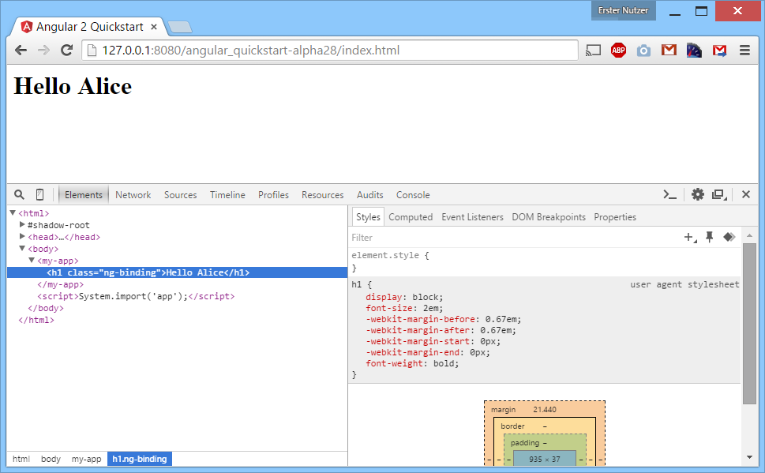
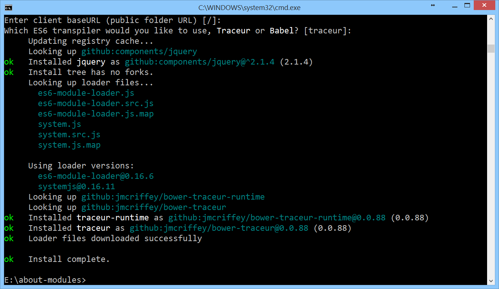

# Angular 2 und modularer Code -- Beispiele

In diesem Verzeichnis finden Sie das im Artikel gezeigte Beispiel unter `src/`.




## Setup & Start

Alle gezeigten Kommandozeilen-Befehle setzen voraus, dass [Node.js](https://nodejs.org/) installiert ist. 

```cmd
$ cd src
$ npm install
$ npm install -g jspm
$ jspm install
$ npm start
```

Nach `npm start` öffnet sich der Standard-Browser.

## Alle Beispiele der Fachartikelreihe

* __[Teil 1 – Modularer Code mit SystemJS und jspm](https://github.com/Angular2Buch/angular2-module)__
* [Teil 2 – Templatesyntax und Web Components](https://github.com/Angular2Buch/angular2-template-syntax)
* [Teil 3 – Dependency Injection und Unit-Testing](https://github.com/Angular2Buch/angular2-testing)
* [Teil 4 – Formularverarbeitung und Validierung](https://github.com/Angular2Buch/angular2-forms)
* [Teil 5 – Routing](https://github.com/Angular2Buch/angular2-routing) 